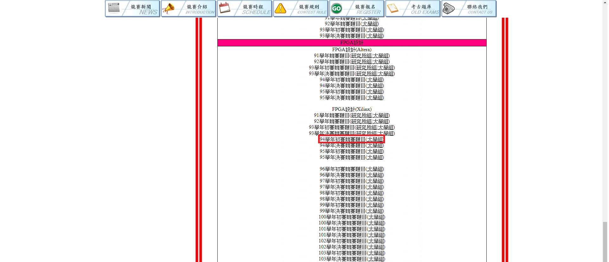

Homework 00 - Verilog Code Practice
==================
# 題目

[由此去](http://icdc.ee.nsysu.edu.tw/2019/index2.php?page=OldExams)

選擇 `FPGA設計(Xilinx)94學年初賽競賽題目(大學組)`

# 繳交期限

**2019/9/30(Mon.) 18:59**

(以最後上傳時間為準)

# 上傳格式

上傳到自己的github內的 /2019_FPGA_Design_GroupX/Lab00/

檔案需要有 : `HDL Code` (EX.Lab00_GroupX.v) 、 `README.md` (基本一定要有 **所有組員的學號**、**模擬結果截圖**、**波形截圖**。)

>註 :請使用競賽提供的testbench進行模擬

>請大家練習撰寫README.md，不僅是為了方便助教們評分，在撰寫README時也能幫助自己更了解自己的作業內容

> [MarkDown撰寫教學](https://markdown.tw/) 、 [推薦.md編輯器](https://atom.io/)
