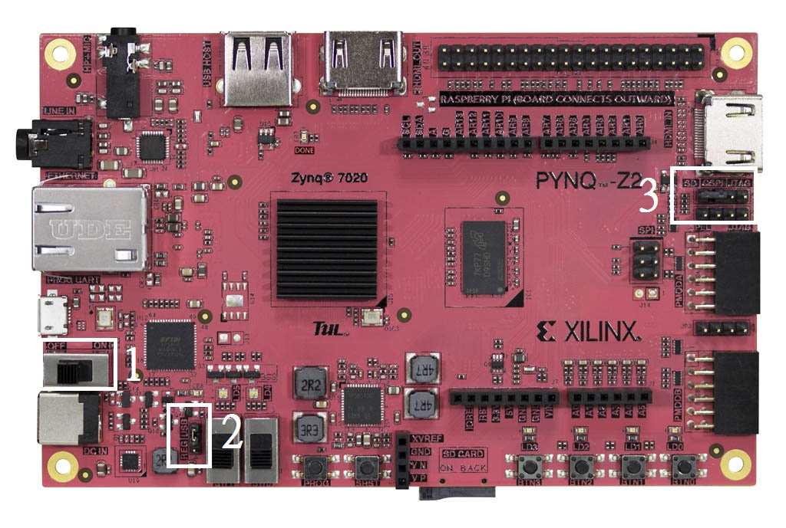
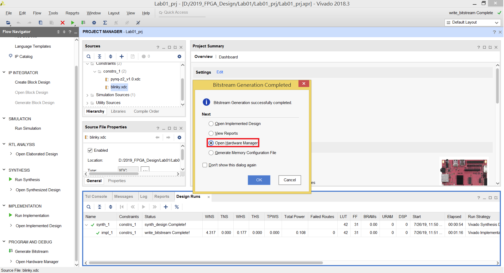
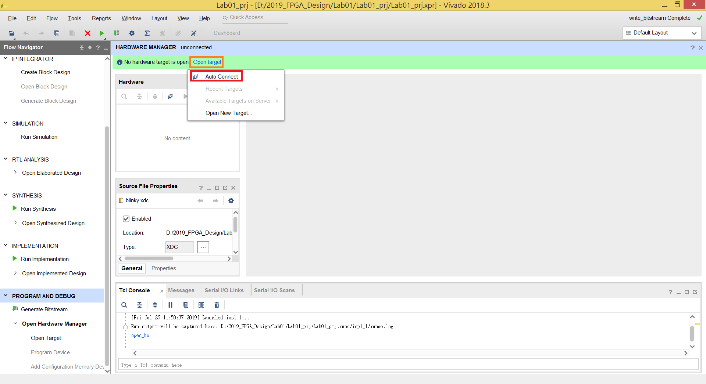
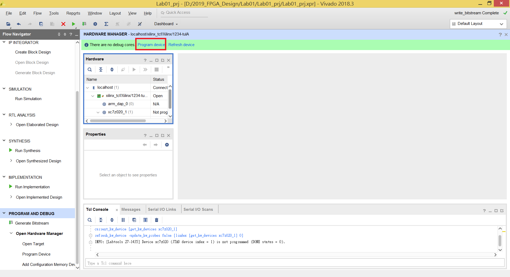

FPGA Design Lab01 - FPGA Implementation of Sequential Logic
=====================
## Purpose
本實驗目的為讓各位了解如何將設計好的序向邏輯電路燒錄到 FPGA 上執行，並加入適當的 Timing Constraints

# Step 1. Create a New Project

回顧 [Lab00](https://github.com/ncku-vlsilab/2019_FPGA_Design/tree/master/Lab00#step-1-create-a-new-project) ， 在 Add Sources 步驟加入本次實驗 /src 內的三個 HDL files `divider.v LED.v top.v`；

在 Add Constraints 步驟加入本次實驗 /xdc 內的兩個 xdc files `pynq-z2_v1.0.xdc blinky.xdc`。

在 Default Board 步驟選擇 Pynq-z2。

(以上步驟以後的Lab都不會再重複敘述，請大家多練習以熟悉這套軟體的操作。)

# Step 2. Generate Bitstream

創建完 Project 後，按下左方 Project Manager 最下方的 `Generate Bitstream`

### 左方 Project Manager 功能說明

**IP Integrator :** 使用 Block Design 來設計整個系統電路，當中可以加入自己設計的 IP、內建的 IP 或是向第三方提供者購買 IP (下一次 Lab 會說明)
> [IP是什麼](https://www.xilinx.com/products/intellectual-property.html)

**Synthesis :** 和一般數位電路的 Synthesis 類似，就是將設計好的 RTL Code 實體化；不過 FPGA 的 Synthesis 是將 RTL 合成一個以 LUT (Look Up Table) 實現的電路。

**Implementation :** 這個步驟是將 Synthesis 後的 LUT 電路架構實際編成到 FPGA 上的可規劃邏輯陣列，可以知道設計的電路在 FPGA 上實際的 Power、LUT Ultilization 等等資訊。

**Generate Bitstream :** 將經過 Implementation 後的電路轉換成一個可以實際燒錄進 FPGA 內的 Memory Structure 的位元串流檔。

# Step 3. 接上板子

拿出板子後**先不要接上 UART 傳輸線**，先確認板子上三處位子設定是否正確。

1. **電源開關** 切換到 `OFF`
2. **電源供應** 切換到 `USB`
> 另一個選項是使用額外的電源供應器，通常是在有外接模組才會需要較大的 POWER。
3. **開機模式** 切換到 `JTAG`

以上三點都確認完後即可插上 UART 傳輸線並開啟 FPGA 的電源。

# Step 4. Program the Device

在 Step 2 產生完 Bitstream 後，Vivado 會自動跳出這個視窗，選擇第三項 `Open Hardware Manager`

按下上方的 `Open Target` 後選擇 `Auto Connect`

在 Vivado 偵測到 FPGA 裝置後，選擇 `Program Device` 後選擇 `Program`

接著就會將 Step 2 所產生的 Bitstream 燒錄進 FPGA ， 即可觀察 Switches 和 LED 的關係。
