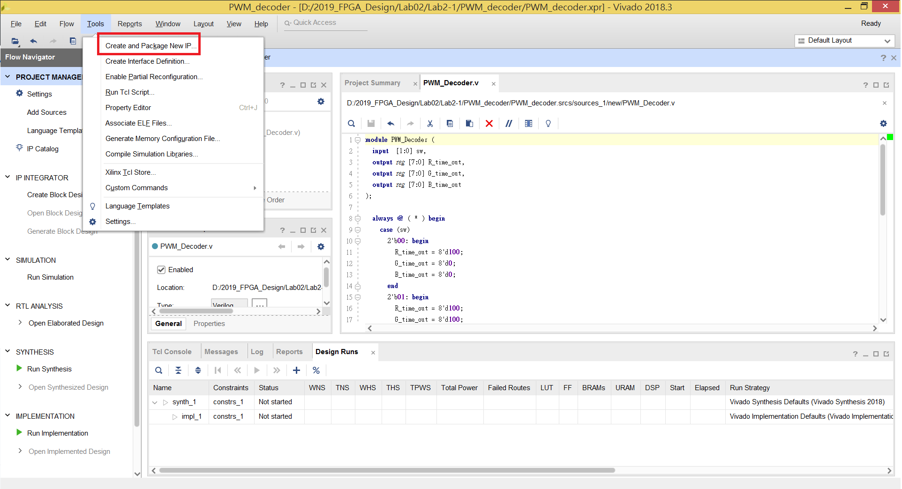
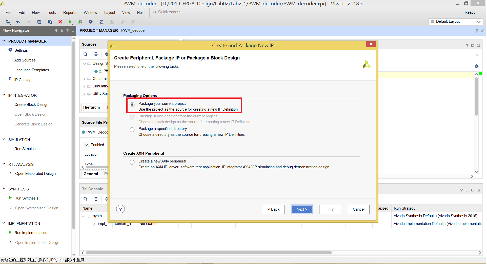
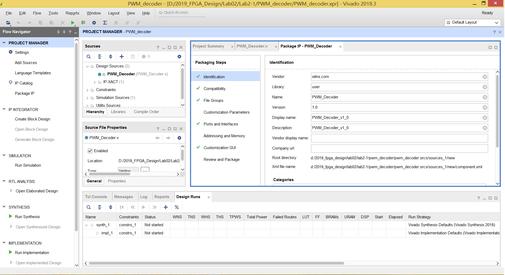
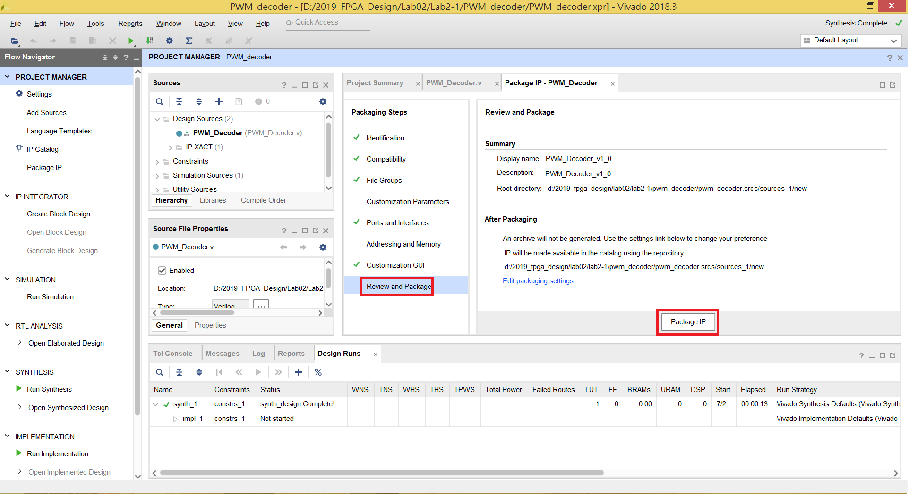
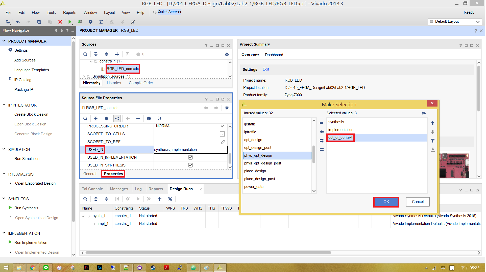
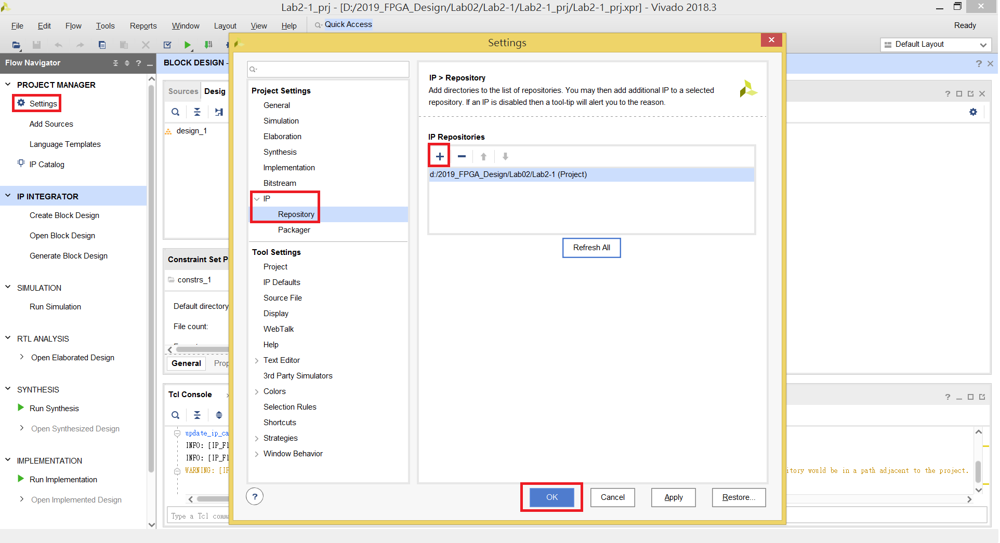
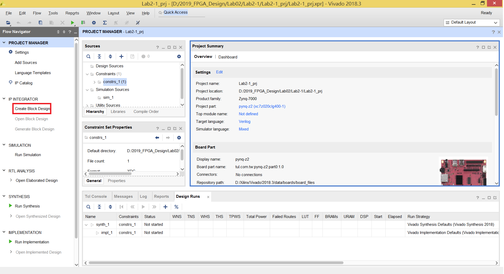
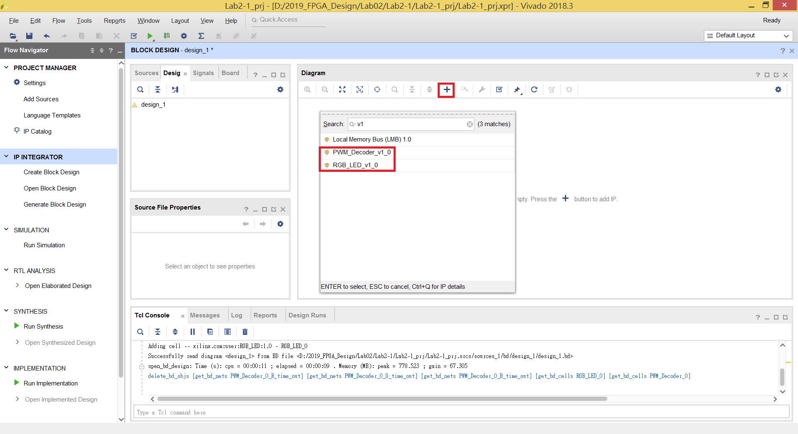
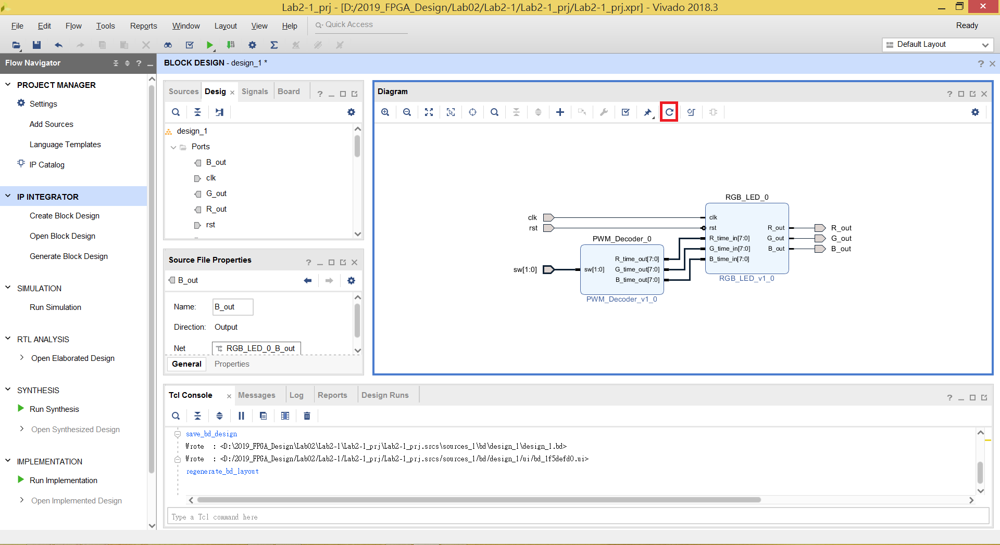

Lab 2-1 - 將自己設計的module包成IP並使用Block Design完成系統設計
================================

# Step 1. Package a IP (non-clock version)

建立一個 Vivado Project，並加入 PWM_decoder.v

完成後選擇上方工具列 `Tool` -> `Create and Package New IP`

選擇 `Package your current project` 後按 Next

完成後如下圖

養成好習慣，每次在包裝 IP 前先合成一次，才不會到 Block Design 的步驟發現有問題。

合成完沒問題後，按下 `Review and Package` -> `Package IP`

完成後關閉Project。

# Step 2. Package a IP (clock version)

建立一個 Vivado Project，並加入 RGB_LED.v 、 RGB_LED_ooc.xdc

在左方 Sources 下選擇 RGB_LED_ooc.xdc，然後到 `Properties` -> `USED_IN` 加入 `out_of_context`

完成後和上一個步驟一樣，進行到 Package IP 的畫面完成 IP 的包裝。

# Step 3. Create a Block Design Project

建立新的 Vivado Project 並只需加入 `pynq-z2_v1.0.xdc`。

創建完成後按下左方 Settings -> IP -> Repository

加入你剛剛存放 IP 的位置。

按下左方的 `Create Block Design`

完成後按下介面上方的 `+` 開啟 IP 列表，選擇我們剛剛包的兩個 IP。

加入兩個 IP 後，在空白處右鍵 -> `Create Port`，為我們的 I/O Port 定義腳位。
> Iput 、 Output 、 以及 Vector 的位元數要注意

完成接線如下圖後，右鍵 -> `Validate Design` ，確定我們的 BD 沒有問題。
> Hint : 拉完線後按下上方的迴轉鍵，程式會讓你的 BD 更加優美。

回到 Source ， 在 design_1 上右鍵 -> `Create HDL Wrapper`。
> 因為 Block Design 只是方便使用者設計系統的一套工具，最終還是得把 BD 轉換成原始的 HDL Code。

回顧產生 Bitstream 的步驟，就可以把電路燒錄到 FPGA 上觀察 Switches 跟 RGB LED 的關係。
