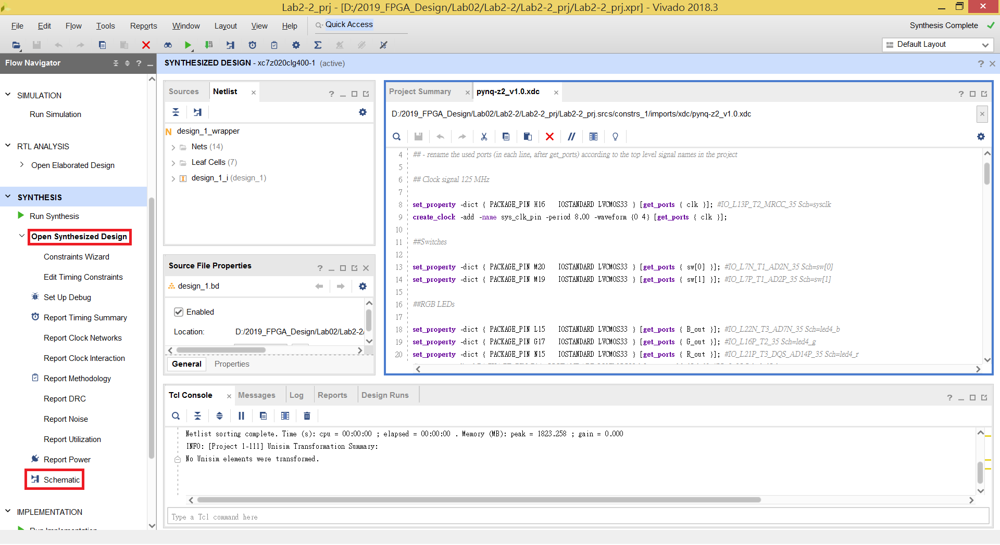
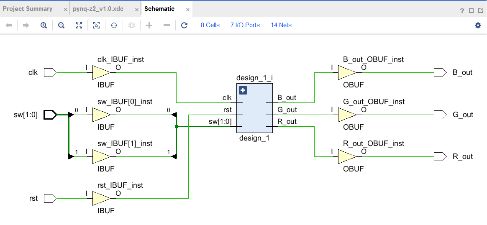
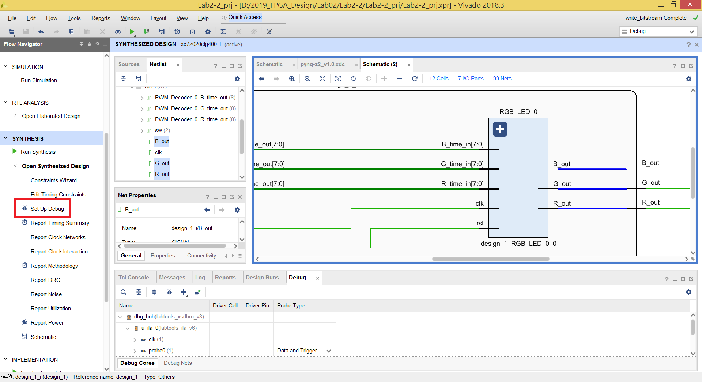
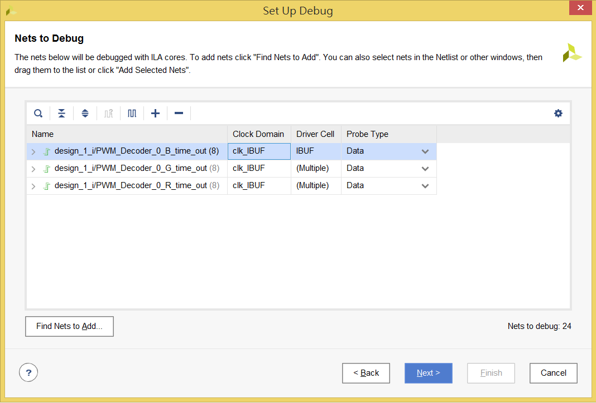
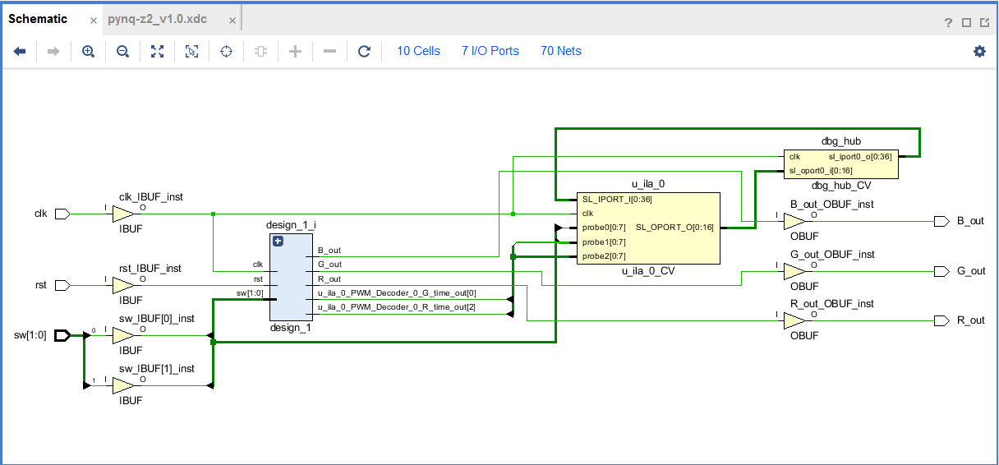
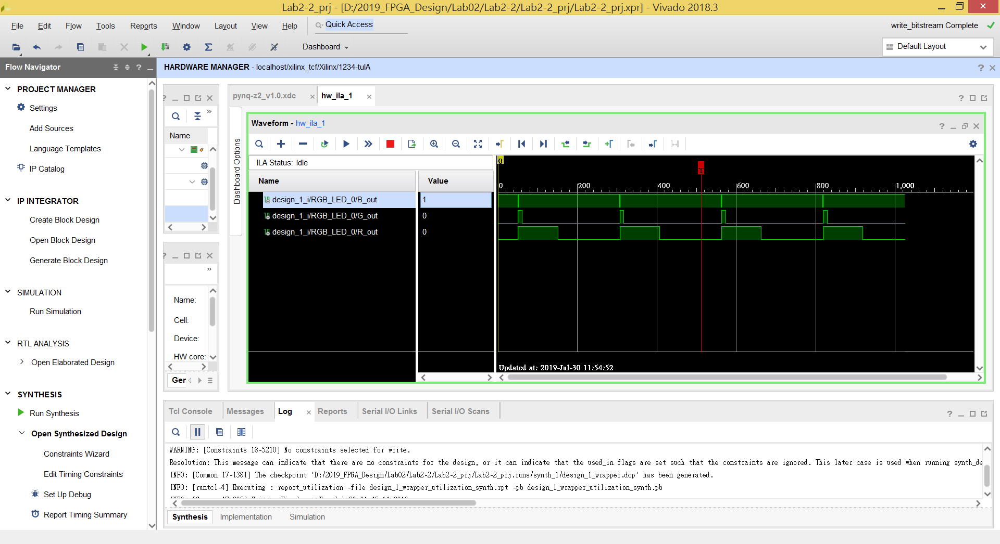

Lab 2-2 - 設置Debugger
================================

## Purpose

設置 Debugger 不只可以用來觀察輸出波形，也可以設置在電路中間的訊號線以觀察設計是否正確。

# Step 1. Create Block Design

仿照 [Lab 2-1 Step3](https://github.com/ncku-vlsilab/2019_FPGA_Design/tree/master/Lab02/Lab2-1#step-3-create-a-block-design-project)，建立 Block Design，並執行到 `Synthesis` 步驟就好。

等待合成完成後，選擇左方工具列 `Open Synthesis Design` -> `Schematic`

看到合成完的電路如下圖

# Step 2. Set up Debugger

假設我們今天想要觀察 PWM Decoder 給出的訊號是否正確

將 Schematic 中的 `design_1` 左上角的 `+` 點開，找到那三條訊號線

按住 Ctrl 選擇那三條線後使其變成藍色後，按下左方的 `Set up Debug`

設定成如下圖

> clock domain 需要右鍵 -> `Select clock domain`

設定完後一路選擇 Next 後 Finish。

再重新合成一次電路，打開 Schematic 會發現多了兩個模組如下圖，就是剛剛設置的 Debugger。

接著產生 Bitstream 並燒錄至 FPGA 上。

改變 Switches 設定，即可觀察輸出的 PWM 波形

