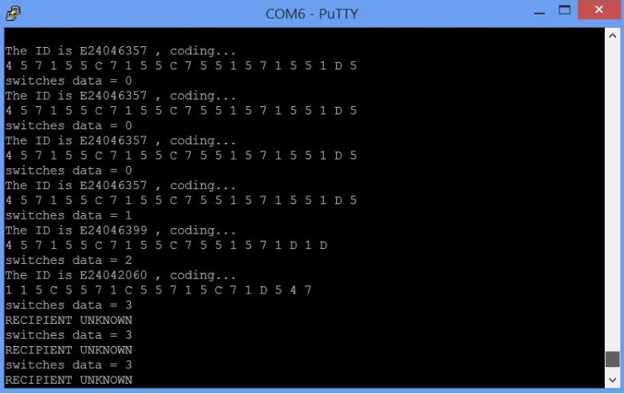

Homework 3
====

# 繳交時間

### Question 1.

請問在不改動任何設定下，ZYNQ CPU 儲存資料的方式是 big-endian 還是 little-endian?

### Program 1 - 使用 AXI GPIO - 控制 RGB LED

**作業說明 :** 請依照 Lab 3-2 的方法，建立一個以 Zynq Processor 和 AXI GPIO 組成的系統，並從 PS 控制 RGB LED。

**作業需求 :**

1. 使用 PS 端控制一顆 RGB LED ，使其依序產生彩虹七色。

2. C Code 需加上註解。

### Program 2 - Hash Function

**作業說明 :** 將組內每個人的學號透過 Hash Function 計算後 Print 在 Terminal 上。

**作業需求 :**

1. 透過 Switch 切換每個人的學號後，直接在 PuTTY 上顯示那組 Switch 對應到哪一組學號，並直接印出 Hash Value。

2. 需在作業說明檔中簡單描述你們選用的 Hash Function。

Example:

### Program 3 - Sorting

**作業說明 :** 使用鍵盤輸入 20 個非負整數後，將此數列從小排到大。

**作業需求 :**

1. 輸入完一個數字後，以 `Enter(\n)` 區隔下一個數字。

2. 輸入了那些數字必須更新在 Terminal 上。

### References

* [Endianness](https://zh.wikipedia.org/wiki/%E5%AD%97%E8%8A%82%E5%BA%8F)
* [hash function 觀念和實務](https://hackmd.io/s/HJln3jU_e)
* [Which hashing algorithm is best for uniqueness and speed?](https://softwareengineering.stackexchange.com/questions/49550/which-hashing-algorithm-is-best-for-uniqueness-and-speed)
