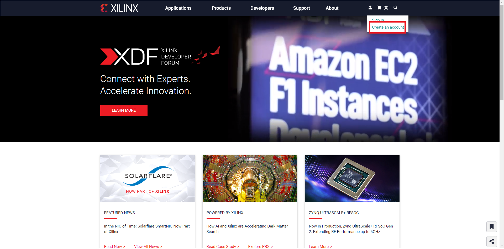
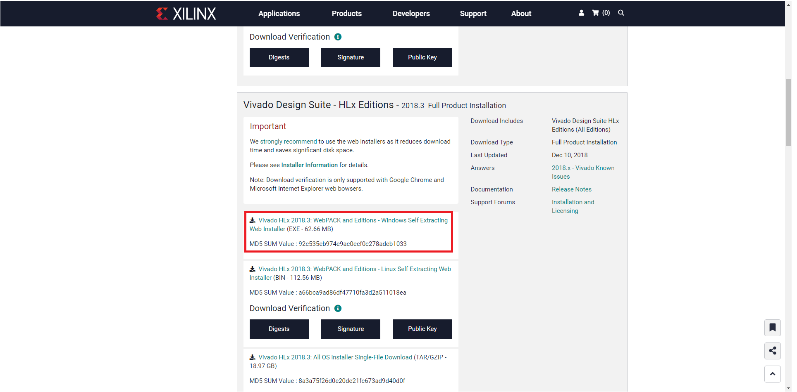
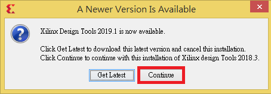
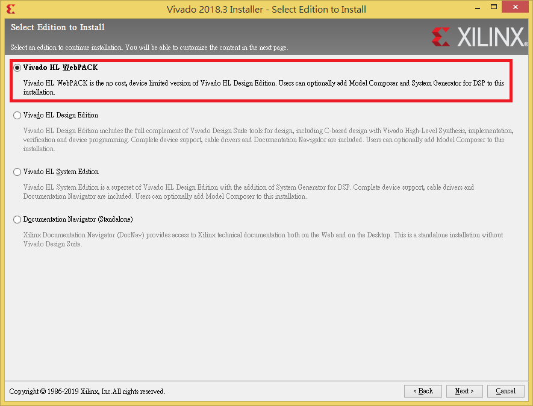

Vivado Installation Tutorial
============================

1. 前往[Xilinx](https://www.xilinx.com/)，創建一個帳號。

2. 前往[這裡](https://www.xilinx.com/support/download/index.html/content/xilinx/en/downloadNav/vivado-design-tools/2018-3.html)，下載 **Vivado 2018.3**

  **註：請盡量按裝在使用者名稱為 "英文" 的電腦**

3. 開啟安裝檔後，由於已經有更新的版本，因此Xilinx會非常好心地請你安裝新版本，不要管它就好。

4. 接著會請你登入，登入後勾選三個 `I Agree` 後下一步，選擇最上面的版本(只有他是免費的)。

5. **!!重要!!** 安裝路徑不可以有中文！

6. 選擇完成後開始安裝，就可以先去吃個晚餐打個球再回來(會裝很久)。
